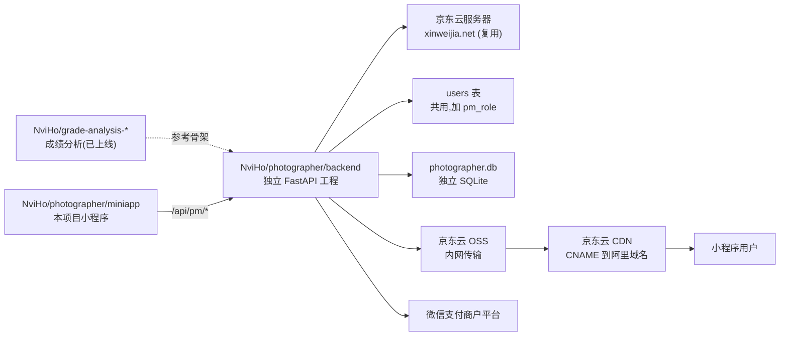
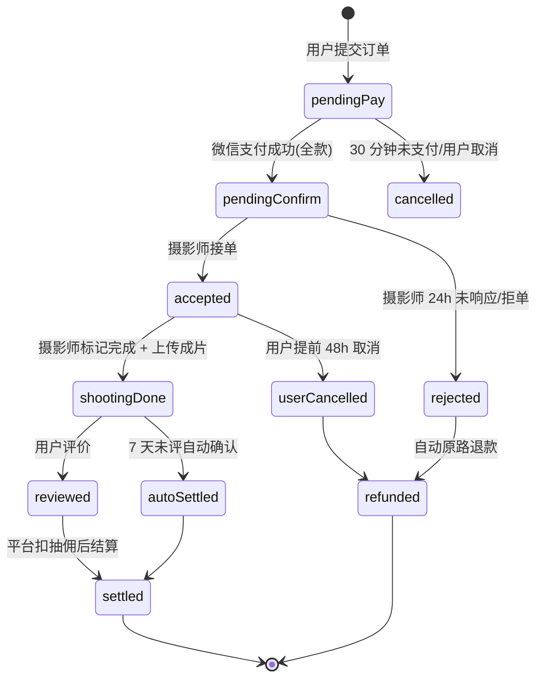
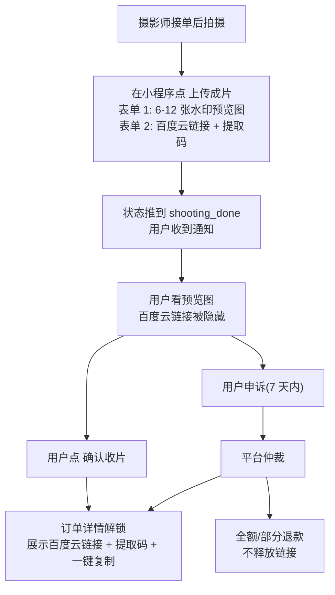
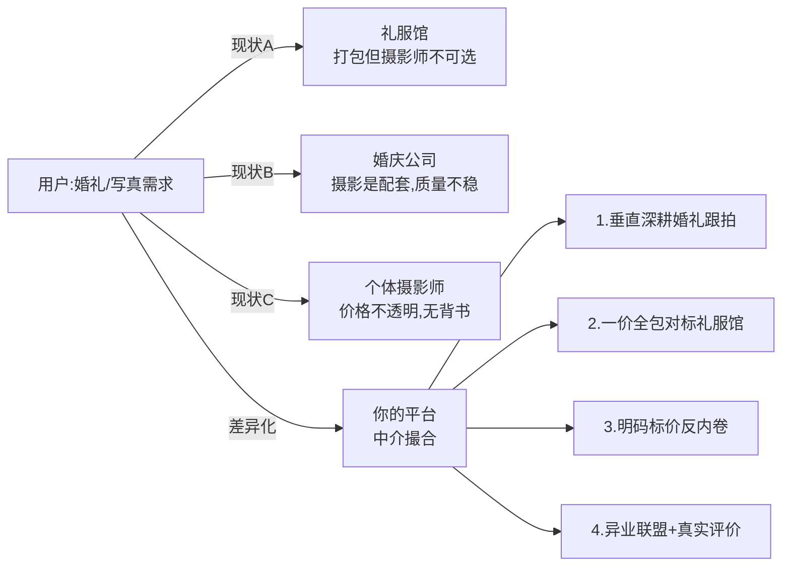
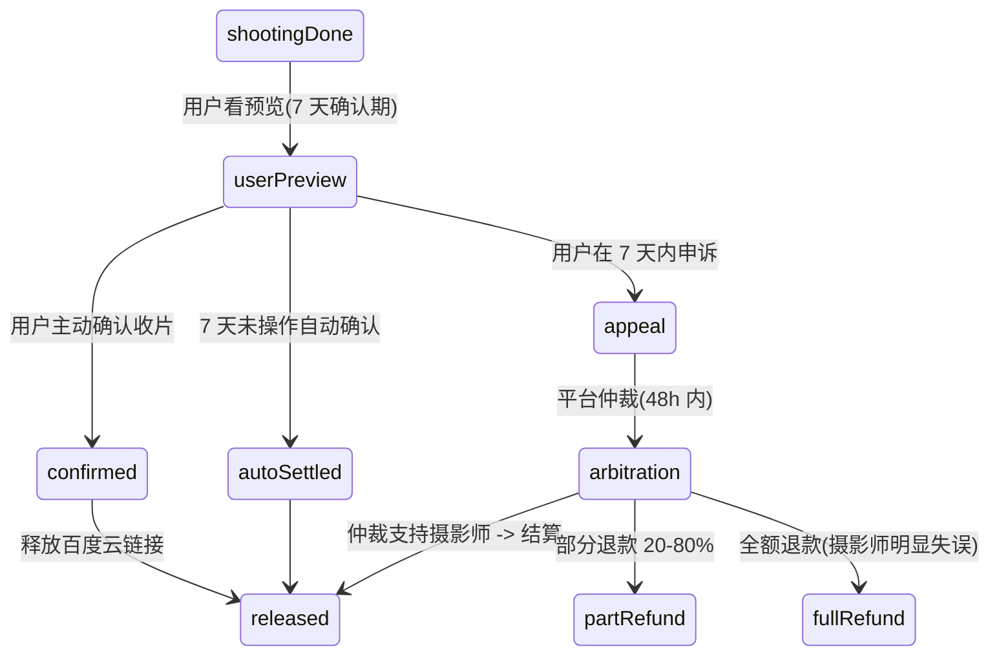
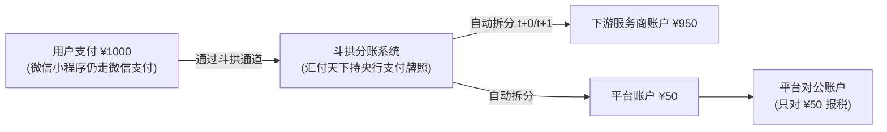
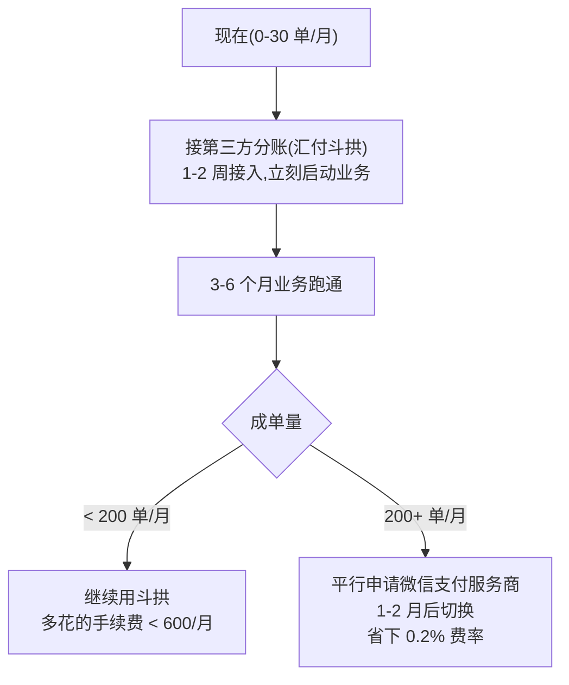

# 摄影师预约小程序 — 产品设计方案 v1.0

> 起草人：技术合伙（Hao） + 大模型协作产出
> 服务对象：太原及周边摄影师 / 有拍摄需求的本地用户
> 文档目的：把"挑摄影师 → 看排期 → 下单 → 成交"做成一条闭环，把中介费稳定地留在平台上

---

## 〇、与现有 NviHo 项目的关系（v1.0 新增）

本项目**作为 NviHo 仓库下的独立子项目**收拢在 `NviHo/photographer/` 目录里，docs / backend / miniapp 全部聚齐，与现有的成绩分析体系（`grade-analysis-*`）边界清晰、互不污染。基础设施层面（云服务器、已备案域名、用户表）选择性复用以降低成本。



边界划分：

| 资源 | 复用 / 新建 | 说明 |
|---|---|---|
| 京东云服务器 `111.228.10.86` | 复用 | 同一台机部署，独立 systemd 服务 + 独立端口 |
| 域名 `xinweijia.net` | 复用 | 已备案，Nginx 按 location `/api/pm/*` 反代到本项目 |
| FastAPI 工程 | **独立** | 在 `NviHo/photographer/backend/` 起独立工程，参考 `grade-analysis-web/backend` 骨架快速搭建 |
| `users` 表 + 微信登录 | 复用 | 跨工程共享同一个 SQLite 数据库或同步用户表，仅加 `pm_role` / `pm_phone` 字段 |
| 数据库 | **独立** | 新建 SQLite 文件 `photographer.db` |
| 对象存储 | **新建** | 京东云 OSS bucket，与服务器内网互通 |
| 小程序 AppID | **新建** | 与成绩分析 `wx9526eae4fdd0b157` 不混用 |
| 微信支付商户号 | **新建** | 单独申请 |

未来日订单破百时，`photographer.db` 平迁 MySQL、整套 backend 直接拆为独立服务（甚至独立服务器）即可，因为工程边界本来就独立，迁移成本可控。

---

## 一、聊天结论复盘（先对齐再设计）

聊天里已经达成的共识，下面所有设计都围绕这几条展开：

1. **核心痛点**：用户找不到摄影师，摄影师找不到活儿；目前线上只能在小红书/抖音上自己找，效率低、联系不方便。
2. **核心模式**：做一个**细分领域的"大众点评 + 美团"**——摄影行业的中介撮合平台。
3. **核心赚钱逻辑**：中介抽佣（成单后从订单里抽成），所以**联系方式必须握在平台手里**，不能让用户和摄影师跳出去私下成交。
4. **冷启动资源**：太原本地，飞机能拉到约 10 位摄影师入驻；摄影师推摄影师可行，用户侧推广是最大难题。
5. **MVP 必须具备**：
   - 摄影师作品展示 + 个人简介
   - 热度值 / 评分星级
   - 不同活儿（跟拍、生日、婚礼、写真等）的**价位区间 / 价格表**
   - 接单范围（先太原 + 太原周边）
   - 排期发布 + 用户预约
6. **参考产品**：飞机发的"路明摄影"用的是"时光盒子"小程序——这是个**摄影师独立展示工具**，不是撮合平台。下面会专门讨论怎么处理这层关系。

---

## 二、关键决策：直接接入"时光盒子" vs 自建摄影师资料

这是你专门问的问题，先给结论，再讲清楚为什么。

### 结论：**自建摄影师资料体系，"时光盒子"只能作为可选的"外链补充"，绝不能作为主展示**

### 为什么不能直接用时光盒子展示

| 维度 | 直接用时光盒子（跳转外链） | 自建资料体系 |
|---|---|---|
| **交易闭环** | 用户跳出去看作品，很可能直接加摄影师微信成交，平台被绕开，**抽佣模式直接失效** | 全流程在站内，订单和联系都走平台 |
| **数据资产** | 作品、浏览、收藏、转化数据都在第三方那里，我们什么都沉淀不下来 | 浏览/收藏/咨询/下单全链路数据归我们，能做推荐和广告投放 |
| **统一体验** | 每个摄影师跳进去样式不一致，用户像在逛集市，决策成本高 | 统一卡片、统一价格表、统一评分，用户能横向比较 |
| **核心功能** | 评分、排期、价位区间、范围筛选这些**我们的核心卖点**根本嫁接不上去 | 全部围绕这套数据来做 |
| **冷启动成本** | 摄影师不用重复填资料 | 摄影师要重新录入，是个真实成本 |
| **风险** | 时光盒子哪天调整规则、收费、下线，我们整个展示就废了 | 自己掌控 |

### 推荐做法：自建为主 + 三个降低摄影师入驻成本的设计

摄影师不愿意重复填资料是真实问题，所以入驻流程要做**极致轻量**：

1. **入驻 5 步走（每步控制在 30 秒）**
   - 微信一键登录 → 填手机号
   - 上传头像 + 1 段不超过 100 字的简介
   - 上传 6~9 张代表作（支持微信相册一键多选）
   - 勾选擅长品类（婚礼/跟拍/生日/写真/全家福/儿童/孕妇/商务）
   - 设置 1~3 档套餐价格 + 接单范围
2. **"导入助手"兜底**：摄影师如果有时光盒子/小红书/抖音/朋友圈链接，可以贴进来，**运营/客服在后台帮他抓图、整理资料**（前 50 个种子摄影师值得人工服务，能极大提升入驻率）
3. **"作品集外链"作为补充字段**：摄影师详情页可以挂一个"完整作品集"按钮，点开是 H5 内嵌的时光盒子页面或自建作品集长图——但**预约按钮永远是醒目的、必须点**的那一个。

> 一句话：时光盒子是"摄影师的个人官网"，我们要做的是"用户挑摄影师的市场"——两者定位不同，必须自己掌控市场。

---

## 三、用户角色与核心流程

### 三类角色

| 角色 | 关键诉求 |
|---|---|
| **C 端用户**（找摄影师的人） | 快速看到本地有谁、看得到作品、看得懂价格、约得到时间、不被坑 |
| **B 端摄影师** | 简单地展示作品、亮出价格和档期、接到订单、收到钱 |
| **平台运营**（你 + 飞机） | 审核摄影师、处理纠纷、运营活动、看数据、调抽佣比例 |

### 核心闭环（用户视角，v1.0 调整为全款托管）

```
打开小程序
  → 首页看推荐 / 按品类筛 / 按城市筛
  → 进摄影师详情页（作品、简介、评分、价格表、档期）
  → 选套餐 + 选档期 + 选拍摄地点
  → 提交需求 → 微信支付【全款】到平台账户
  → 摄影师确认接单（拒单则原路退款）
  → 完成拍摄 → 摄影师上传成片
  → 用户 7 天确认期内确认收片 / 7 天未操作自动确认
  → 平台扣抽佣后结算给摄影师
  → 评价 + 晒图 → 沉淀为新摄影师作品和口碑
```

> v0.1 的"30% 定金"模式作为后续可选商业策略，等订单量上来后再开。MVP 阶段统一走"全款 + 平台资金托管"，规则简单、纠纷少、信任建立快。

### 核心闭环（摄影师视角）

```
入驻 → 完善资料 → 通过审核
  → 设置档期（哪些天空、哪些天满、哪些天加价）
  → 接单通知（小程序订阅消息 + 短信）
  → 沟通 → 完成拍摄 → 上传成片
  → 用户确认 → 平台扣抽佣 → 提现到账
```

---

## 四、功能模块设计

### 4.1 MVP（第一版，2~3 个月内必须上线）

按"最小可成交闭环"取舍，下面的模块**少一个都跑不通**：

#### C 端（用户端）

- **首页**
  - 顶部城市切换（默认太原）
  - 品类入口图标（婚礼 / 跟拍 / 生日 / 写真 / 全家福 / 儿童 / 孕妇 / 商务）
  - 推荐摄影师瀑布流（按热度值排序，作品大图为主）
  - 搜索框（按摄影师名 / 标签搜）
- **摄影师列表页**
  - 筛选：品类、价格区间、星级、距离
  - 排序：综合 / 热度 / 价格升降 / 评分
- **摄影师详情页**（最重要的转化页面）
  - 头图 + 作品九宫格（点击大图浏览）
  - 简介、擅长品类标签
  - **价格表卡片**（套餐名 / 时长 / 包含什么 / 价格）
  - **档期日历**（绿=空，黄=部分，红=满）
  - 评分 + 评价列表（带用户晒图）
  - 接单范围（地图 + 文字"太原市内 / 周边 50km +200 元"）
  - 底部固定按钮：「立即预约」「咨询」（咨询走站内 IM，不给微信）
- **预约页**
  - 选套餐 → 选日期 → 填地点 → 备注 → 提交
  - **微信支付全款到平台账户**（v1.0 调整）
- **订单中心**
  - 待接单 / 待拍摄 / 待确认收片 / 已完成 / 已取消
- **评价**
  - 5 星 + 标签 + 文字 + 晒图
- **个人中心**
  - 收藏的摄影师、消息、订单、客服

#### B 端（摄影师端，初期可以做在同一个小程序里，用"摄影师入驻"切换身份）

- 入驻 + 资料管理
- **作品管理**（增删改、调整顺序、设置封面）
- **价格表管理**
- **档期管理**（拖拽日历批量设置空/满/加价）
- **订单管理**（接单、拒单、上传成片、申请尾款）
- **资金账户**（收入、抽佣明细、提现）
- 站内消息

#### 平台运营后台（Web）

- 摄影师审核
- 订单管理 + 纠纷处理
- 抽佣比例配置
- 内容审核（防止上传违规作品）
- 数据看板（DAU、订单数、GMV、转化漏斗）

### 4.2 第二阶段（上线后 1~3 个月，看数据加）

- **达人/榜单**：太原跟拍 TOP10、本周新晋摄影师，配合小红书种草
- **优惠券 / 拼单**：拉新券、新人首单立减、闺蜜拼单写真
- **分销裂变**：用户邀请用户得券、摄影师邀请摄影师得流量加权
- **直播预约**：周末摄影师在线讲跟拍技巧（其实是引流和信任建设）
- **AI 风格匹配**：用户上传几张喜欢的图，推荐风格相近的摄影师
- **定金模式**：作为可选商业策略开放（30% 定金 + 70% 拍摄后尾款）

### 4.3 第三阶段（半年后）

- 跨城市扩张（太原成熟后复制到大同、晋中、呼和浩特等周边）
- 周边品类延伸（化妆师、跟妆、礼服租赁、场地推荐 → 把"一场拍摄"打包）
- B 端 SaaS：给摄影师卖更高级的工具（电子合同、客片管理、自动相册），从撮合费扩展到工具费

---

## 五、关键页面信息架构

### 5.1 首页

```
┌─────────────────────────────────┐
│ 太原 ▼          🔍 搜索摄影师/标签  │
├─────────────────────────────────┤
│ [Banner 轮播：限时活动 / 新人券]    │
├─────────────────────────────────┤
│  💍婚礼  📸跟拍  🎂生日  👶儿童     │
│  👰写真  👨‍👩‍👧 全家福  🤰孕妇  💼商务 │
├─────────────────────────────────┤
│ 「本周热门」                       │
│ ┌──────┐ ┌──────┐                │
│ │作品大图│ │作品大图│  ← 摄影师卡片 │
│ │张三   │ │李四   │  头像/星级/    │
│ │⭐4.9  │ │⭐4.8  │  起拍价/标签   │
│ │¥299起│ │¥499起│                │
│ └──────┘ └──────┘                │
│ ...瀑布流加载更多                   │
└─────────────────────────────────┘
```

### 5.2 摄影师详情页（转化的核心战场）

```
┌─────────────────────────────────┐
│ [头图 1张大作品]                   │
├─────────────────────────────────┤
│ 头像 张三摄影  ⭐4.9 (128单)       │
│ 标签：跟拍 / 写真 / 户外           │
│ "10 年跟拍经验，擅长自然光..."     │
├─────────────────────────────────┤
│ 📷 作品（共 36 张） →              │
│ [九宫格预览，点击全屏轮播]         │
├─────────────────────────────────┤
│ 💰 价格表                         │
│ ┌─────────────────────────────┐ │
│ │ 半日跟拍 4h  ¥599  含 50 张精修│ │
│ │ 全日跟拍 8h  ¥999  含 100 张  │ │
│ │ 婚礼跟拍     ¥2999 含...      │ │
│ └─────────────────────────────┘ │
├─────────────────────────────────┤
│ 📅 档期（点击查看本月）            │
│ [月历，绿/黄/红 三色]              │
├─────────────────────────────────┤
│ 📍 接单范围                        │
│ 太原市内 / 周边 50km +200          │
├─────────────────────────────────┤
│ ⭐ 用户评价 (128)                  │
│ [评价卡片 + 晒图缩略图]            │
├─────────────────────────────────┤
│ 完整作品集 →（可选，外链时光盒子）  │
└─────────────────────────────────┘
[💬 咨询]   [📅 立即预约]   ← 底部固定
```

### 5.3 摄影师工作台

```
今日待办：2 单待确认 / 1 单待上传成片
─────────────────────────
本月收入：¥8,420  抽佣：¥842  到账：¥7,578
─────────────────────────
[档期管理] [作品管理] [价格表] [订单] [提现]
```

---

## 六、数据模型

### 6.1 表清单（v1.0 加 `pm_` 前缀，复用现有 users 表）

```
users（复用现有，[backend/app/models/user.py]）
  - 已有：id, wx_openid, username, real_name, ...
  - v1.0 新增：pm_role (user|photographer|both|admin), pm_phone

pm_categories（活儿类型字典，v1.0 拆出独立）
  - id, code, name, icon, sort

pm_photographers（摄影师档案，与 users 1:1）
  - id, user_id, real_name, intro, avatar_cover
  - service_cities[], service_radius_km
  - hot_score (热度值，由系统算)
  - rating_avg, rating_count, completed_orders
  - status (pending|approved|frozen)
  - external_portfolio_url (外链作品集，可选)
  - contact_phone (脱敏存储，仅订单成立后释放)

pm_photographer_categories（摄影师 ↔ 品类，多对多）
  - photographer_id, category_id

pm_works（作品）
  - id, photographer_id, image_url (京东云 OSS 路径)
  - thumb_url, cover, sort, category_id, created_at

pm_packages（套餐/价格表）
  - id, photographer_id, category_id, name, duration_hours
  - includes (text), price, deposit_rate (v2 才用)

pm_schedules（档期）
  - id, photographer_id, date, status (free|partial|busy|blocked)
  - price_adjust (加价金额)

pm_orders（订单）
  - id, no, user_id, photographer_id, package_id
  - shoot_date, location, requirements
  - amount_total, commission, commission_rate
  - status (见 §6.5 状态机)
  - timeline_json (节点时间戳)
  - created_at, paid_at, accepted_at, completed_at, settled_at

pm_payments（支付流水，对账用）
  - id, order_id, wx_transaction_id, amount, type (pay|refund)
  - raw_callback (微信回调原文)

pm_reviews（评价）
  - id, order_id, user_id, photographer_id
  - rating, tags[], text, images[]

pm_messages（站内 IM，订单维度）
  - id, order_id, from_user_id, to_user_id, content, type (text|image)

pm_wallets / pm_withdraws（摄影师钱包与提现）
  - balance, frozen, total_income, total_commission
  - 提现申请记录
```

> 抽佣比例 `commission_rate` **写在订单上而不是写在配置里**——这样以后调整不影响历史订单。

### 6.5 订单状态机（v1.0 新增）



| 状态 | 触发动作 | 订阅消息推送对象 | 超时规则 |
|---|---|---|---|
| `pending_pay` | 用户提交订单 | — | 30 分钟未支付 → cancelled |
| `pending_confirm` | 微信支付成功回调 | 摄影师 | 24h 未响应 → rejected + 退款 |
| `accepted` | 摄影师接单 | 用户 | 拍摄日 +1 天未上传成片，运营介入 |
| `rejected` | 摄影师拒单 | 用户 | 立即触发原路退款 |
| `shooting_done` | 摄影师上传成片 | 用户 | 7 天未确认 → auto_settled |
| `reviewed` | 用户评价 | 摄影师 | — |
| `settled` | 平台扣佣后转账 | 摄影师 | T+1 自动结算 |
| `refunded` | 退款完成 | 用户 + 摄影师 | — |

---

## 七、技术选型（v1.0 全面对齐现有项目）

| 层 | 技术 | 理由 |
|---|---|---|
| **小程序前端** | Taro 4 + React + TypeScript + Zustand | 与 [NviHo/grade-analysis-miniapp/grade-mp](../../../郝英伟/github_nviho/NviHo/grade-analysis-miniapp/grade-mp) 完全对齐，可复用 [api/client.ts](../../../郝英伟/github_nviho/NviHo/grade-analysis-miniapp/grade-mp/src/api/client.ts) 等基础设施 |
| **UI 库** | NutUI-React-Taro 或 Taro UI | Taro 生态主流，组件多 |
| **后端** | FastAPI + SQLAlchemy（独立工程） | 新建独立工程 `NviHo/photographer/backend/`，参考 [grade-analysis-web/backend](../../grade-analysis-web/backend) 骨架，路由前缀 `/api/pm/*` |
| **数据库** | 独立 SQLite 文件 `photographer.db` | 业务隔离，未来日订单破百迁 MySQL；用户体系**复用** `users` 表 |
| **对象存储** | **京东云 OSS** | 与服务器同云，**内网传输零费用、不占 5Mbps 公网带宽** |
| **CDN** | **京东云 CDN** | CNAME 挂在阿里注册的现有域名下 |
| **后端 SDK** | `jdcloud-sdk-python` | 京东云官方 Python SDK |
| **图片处理** | OSS 自带样式参数（缩略、水印） | 不用自建 imgproxy |
| **支付** | 微信支付 JSAPI | 单独申请商户号，**与开发并行启动**（审批 3-7 天） |
| **消息推送** | 微信订阅消息 + 短信兜底（京东云短信） | 摄影师必须秒接通知 |
| **IM** | 自建简版（FastAPI + WebSocket） | MVP 阶段够用 |
| **后台管理** | MVP 阶段先用 backend FastAPI 自带的 Swagger UI + 简易管理路由 | 等 GMV 起量后再单独做 React + Ant Design 后台 |
| **部署** | 京东云轻量服务器 `111.228.10.86` + `xinweijia.net` 已备案 | 复用现有 |
| **监控** | Sentry + 京东云日志服务 | 上线后第一时间发现问题 |

> **预算估算（MVP 跑一年）**：京东云 OSS（< 100GB） + CDN 流量 + 短信 + 微信支付费率 ≈ **¥2000~4000/年**。

### 7.5 服务器现状评估（v1.0 新增，基于 2026-04-30 实测）

**实测数据**：

```
load average: 0.02, 0.26, 0.73   (4 核机器，远低于 1 = 闲)
%Cpu(s): 25.4 us, 72.6 id        (3 核闲置)
MiB Mem: 7949 total, 5573 used, 2004 avail
```

业务进程实际占用：

| 进程 | 内存 | CPU | 评估 |
|---|---|---|---|
| `uvicorn` (成绩分析后端) | 67 MB | 0.3% | 极轻 |
| `python3` | 14 MB | 0.3% | 极轻 |
| **小计** | **< 100 MB** | **< 1%** | — |

高占用元凶（与业务无关）：

| 进程 | 内存 | CPU | 处置 |
|---|---|---|---|
| **CordC** GUI 应用 | **3.7 GB** | **95.0%** | **关停** |
| CordCCore × 2 | ~85 MB | 0.6% | **关停** |
| Xtigervnc + xfwm4 + xfce4 + panel + dbus | ~150 MB | 6.3% | **关停** |

清理前后对比：

| 指标 | 当前 | 清理后预期 | 评估 |
|---|---|---|---|
| CPU 4 核 | us 25.4% / id 72.6% | id > 95% | 极闲 |
| 内存 8 GB | used 5.5 GB / avail 2 GB | avail > 6 GB | 极宽裕 |
| 系统盘 180 GB | 已用 78%（剩 38 GB） | 清理后 ~60% | 图片走 OSS 后无忧 |
| 带宽 5 Mbps | 公网瓶颈 | 不变 | 图片走 OSS+CDN 后不再相关 |

**三条硬性约束**：

1. **上线前必须关停** CordC、xfce4、Xtigervnc（释放 ~4 GB 内存）
2. **摄影师作品图片必须走京东云 OSS + CDN**，本地服务器只存 db 和日志
3. **配置完全够用，不需要扩容**（4 核 8G 跑 photographer + grade-analysis 双业务，资源占用 < 500MB）

### 7.6 工程目录与 API 路由（v1.0 新增，v1.0.1 调整为统一目录）

#### 目录结构

本项目所有内容收拢在 `NviHo/photographer/` 下，docs / backend / miniapp 三层同级，方便管理。

```
NviHo/                                   现有仓库
├── grade-analysis-miniapp/              已有(成绩分析,不动)
├── grade-analysis-web/                  已有(成绩分析,不动)
└── photographer/                        ★ 本项目所有内容收拢于此
    ├── README.md                        项目入口
    ├── docs/
    │   └── 方案.md                       本文档
    ├── backend/                         独立 FastAPI 工程
    │   ├── app/
    │   │   ├── main.py                  入口,注册所有路由
    │   │   ├── config.py
    │   │   ├── database.py              photographer.db engine
    │   │   ├── deps.py                  鉴权/分页等依赖项
    │   │   ├── models/                  pm_photographers / pm_orders / ...
    │   │   ├── schemas/                 Pydantic 模型
    │   │   ├── routers/
    │   │   │   ├── auth.py              /api/pm/auth/*(微信登录)
    │   │   │   ├── photographers.py     /api/pm/photographers/*
    │   │   │   ├── orders.py            /api/pm/orders/*
    │   │   │   ├── payments.py          /api/pm/pay/*
    │   │   │   ├── pgr.py               /api/pm/pgr/*(摄影师自助)
    │   │   │   ├── uploads.py           /api/pm/uploads/*
    │   │   │   └── admin.py             /api/pm/admin/*(运营后台)
    │   │   ├── services/
    │   │   │   ├── wxpay.py             微信支付封装
    │   │   │   ├── jd_oss.py            京东云 OSS 上传/签名 URL
    │   │   │   ├── hot_score.py         热度算法(每日定时刷新)
    │   │   │   └── notify.py            订阅消息 + 短信
    │   │   └── utils/
    │   ├── tests/
    │   ├── requirements.txt
    │   ├── .env.example
    │   └── README.md                    后端启动/部署说明
    └── miniapp/
        └── photographer-mp/             Taro 4 工程根
            ├── src/
            │   ├── app.ts
            │   ├── app.config.ts        路由 + tabBar
            │   ├── app.scss
            │   ├── pages/
            │   │   ├── home/            首页
            │   │   ├── photographer/    列表 + 详情
            │   │   ├── order/           下单 + 我的订单 + 评价
            │   │   ├── profile/         个人中心
            │   │   └── pgr/             摄影师端(同小程序角色切换)
            │   ├── api/
            │   │   ├── client.ts        HTTP 封装(参考成绩分析)
            │   │   ├── photographers.ts
            │   │   ├── orders.ts
            │   │   └── pgr.ts
            │   ├── stores/
            │   │   ├── user.ts          Zustand 用户态
            │   │   └── order.ts
            │   ├── components/
            │   │   ├── PhotographerCard/
            │   │   ├── WorkGrid/
            │   │   ├── PackageItem/
            │   │   ├── ScheduleCalendar/
            │   │   └── OrderStatusBadge/
            │   └── assets/
            ├── config/                  Taro 编译配置
            ├── project.config.json      新申请的 AppID
            ├── package.json             Taro 4 + React + TS
            └── README.md                小程序启动/上传说明
```

#### 部署关系

- 后端独立部署在京东云服务器,作为新的 systemd 服务(如 `photographer-backend.service`),监听独立端口(如 8001),与成绩分析的 `grade-analysis.service` 互不影响
- Nginx 在 `xinweijia.net` 上按 location 分流: `/api/*` 走成绩分析后端 8000 端口, `/api/pm/*` 走本项目后端 8001 端口
- 数据库各自独立的 SQLite 文件,不共享 engine

#### API 路由表（节选）

| Method | Path | 说明 |
|---|---|---|
| POST | `/api/pm/auth/wx-login` | 微信登录（复用现有逻辑，扩展返回 `pm_role`） |
| GET | `/api/pm/categories` | 品类字典 |
| GET | `/api/pm/photographers` | 列表（query: `category_id` / `city` / `sort_by={hot,rating,price}` / `price_min` / `price_max`） |
| GET | `/api/pm/photographers/{id}` | 详情聚合（作品 / 套餐 / 最近评价） |
| GET | `/api/pm/photographers/{id}/schedule?month=YYYY-MM` | 档期 |
| POST | `/api/pm/orders` | 创建订单 + 唤起微信支付 |
| GET | `/api/pm/orders` | 我的订单列表 |
| GET | `/api/pm/orders/{id}` | 订单详情 |
| POST | `/api/pm/orders/{id}/accept` | 摄影师接单 |
| POST | `/api/pm/orders/{id}/reject` | 摄影师拒单 |
| POST | `/api/pm/orders/{id}/complete` | 摄影师标记完成 + 上传成片 |
| POST | `/api/pm/orders/{id}/cancel` | 用户取消（48h 前） |
| POST | `/api/pm/orders/{id}/review` | 用户评价 |
| POST | `/api/pm/pay/wx-callback` | 微信支付回调（无需鉴权，验签即可） |
| POST | `/api/pm/uploads/sign` | **直传**京东云 OSS 的签名 URL（图片不经过我们服务器） |
| POST | `/api/pm/pgr/apply` | 摄影师入驻申请 |
| PUT | `/api/pm/pgr/me` | 摄影师档案更新 |
| POST/PUT/DELETE | `/api/pm/pgr/works` | 作品管理 |
| POST/PUT/DELETE | `/api/pm/pgr/packages` | 套餐管理 |
| PUT | `/api/pm/pgr/schedule` | 档期批量更新 |

> 图片上传走"客户端直传 OSS"模式：客户端从 `/api/pm/uploads/sign` 拿签名 URL，**直接 PUT 到 OSS**，完全不经过我们服务器，省带宽、提速度。

---

## 八、商业模式与抽佣设计

### 收入结构

1. **撮合抽佣（核心）**：每单按 GMV 抽 **8%~15%**（行业常见区间，初期可以低，比如 5%~8%，吸引摄影师，等粘性起来再调）
2. **置顶曝光**：摄影师付费让自己出现在首页/品类页前面（类似美团竞价）
3. **会员/SaaS 工具**：第二阶段做（电子合同、自动相册等）
4. **广告**：本地化妆师、礼服店投广告（第三阶段）

### 资金流（重要）

- 用户支付的钱**必须先进平台账户**（用微信支付的"分账"或先入平台再人工打款）
- **摄影师确认完单 + 用户确认收片** 后，钱才结算给摄影师
- 这是抽佣能稳定收的前提，也是用户信任的基础

### 防绕单设计（直接关系到能不能赚钱）

| 措施 | 说明 |
|---|---|
| 不显示微信号/手机号 | 详情页和聊天里全部脱敏，只能在站内 IM 聊 |
| IM 关键词识别 | "加我微信""V 信""手机号"等触发软提醒，多次触发限流 |
| 联系信息只在订单成立后释放 | 而且只释放一次性虚拟号（中间号） |
| 用户晒图返券 | 鼓励用户在平台评价晒图，而不是发朋友圈带摄影师微信 |
| 摄影师协议条款 | 明确"绕单"会被冻结、扣保证金 |

---

## 九、冷启动策略（重点解决"用户上有点难"）

聊天里飞机最担心这个，下面给一套可执行的打法：

### 9.1 摄影师侧（飞机负责，相对简单）

- 飞机直接拉 10 个摄影师入驻，**前 30 个摄影师免抽佣 3 个月**
- 摄影师拉摄影师返流量加权（首页排序加分）
- 给摄影师做**统一海报模板**：每个摄影师有自己的二维码，发朋友圈时自带平台 logo

### 9.2 用户侧（最难，必须打组合拳）

1. **种草内容矩阵**：在小红书/抖音以"太原跟拍避坑指南""太原最值得约的 10 位摄影师"等内容获客，**底部统一引导扫码进小程序**
2. **新人首单立减 ¥50**：低成本让用户先下一单
3. **摄影师本身的私域**：每个摄影师的老客户群、朋友圈，是最直接的种子用户来源
4. **"晒图返现"**：用户在小程序晒图 + 在小红书/朋友圈带话题，返 ¥10~20 现金券
5. **本地异业合作**：跟太原本地的婚纱店、宝宝照相馆、儿童乐园合作，互相导流
6. **校园/月子中心地推**（孕妇照、新生儿、毕业季三个高频品类）

### 9.3 数据驱动（上线第一天就要看）

- 每天看：新增用户、新增摄影师、新增订单、转化漏斗每一步的流失率
- 每周复盘：哪些品类好卖？哪些摄影师转化高？为什么？
- A/B 测试详情页排版（价格表前置 vs 作品前置 vs 评价前置）

---

## 十、风险与应对

| 风险 | 应对 |
|---|---|
| 摄影师绕单 | 站内 IM + 中间号 + 协议 + 晒图返券（见上文） |
| 用户起量慢 | 先把"摄影师 + 摄影师私域"用透，平台不指望一开始就投流 |
| 内容侵权（盗图） | 上传时 OSS 自动加暗水印；要求摄影师勾选"原创承诺" |
| 用户对成片不满意 | 平台介入仲裁机制 + 7 天确认期 + 部分退款规则 |
| 微信小程序审核驳回 | 类目选"商业服务/婚庆服务"或"丽人/摄影"，资质提前准备 |
| 时光盒子做撮合 | 我们的差异化：本地化运营 + 价格透明 + 撮合保障，**做深做窄** |
| 一个人开发节奏紧 | MVP 严格砍范围，IM、提现、运营后台先用最简版 |
| 服务器资源被 GUI 应用挤占 | 上线前清理 CordC + xfce4 + VNC（v1.0 新增约束） |

---

## 十一、开发路线图（v1.0 细化）

### 第 0 周：资质串行 + 服务器清理（与开发并行）

> 这一周是关键路径上的"等待项"，必须最先启动。

- [ ] 申请新小程序 AppID（类目"丽人/摄影"或"商业服务/婚庆服务"）
- [ ] 申请微信支付商户号（个体工商户即可，3-7 天审批）
- [ ] 开通京东云 OSS bucket + CDN，配置 CNAME 到现有阿里域名
- [ ] **服务器清理**：
  - `systemctl stop` / 删除 CordC、CordCCore 进程及 AppImage
  - 卸载 xfce4 + tigervnc（释放 ~3GB 磁盘）
  - 清理 apt 缓存 + 旧 node_modules + dist 产物
  - 目标：磁盘从 78% 降到 60% 以下，内存从 5.5G 降到 1.5G 以下
- [ ] 飞机准备 10 位种子摄影师名单 + 联系方式

### 第 1 周：后端地基

- 后端 `NviHo/photographer/backend/app/` 工程脚手架（main / database / models / schemas / routers）
- pm_* 表创建（含数据库迁移逻辑）
- `users` 表加 `pm_role` / `pm_phone` 字段（沿用 grade-analysis-web 的 `_run_migrations` 模式）
- 微信登录适配（参考 `[grade-analysis-web/backend/app/routers/auth.py]` 实现），扩展返回 `pm_role`
- 京东云 OSS 上传服务（`services/jd_oss.py`），支持客户端直传签名

### 第 2 周：摄影师入驻与档案管理

- `POST /api/pm/pgr/apply` 入驻申请
- `PUT /api/pm/pgr/me`、`/works`、`/packages`、`/schedule`
- 运营后台：先用 FastAPI Swagger UI + 简易 admin 路由审核摄影师
- **目标**：让 10 位种子摄影师**先把资料填进来**（在没有用户端的情况下也要先填，逼出真实问题）

### 第 3-4 周：用户端浏览闭环

- 小程序工程脚手架 `NviHo/photographer/miniapp/photographer-mp/`（对齐 grade-mp 的 Taro 4 + React + TS）
- 首页、列表、详情、档期日历
- 收藏、品类筛选

### 第 5-6 周：下单 + 微信支付闭环

- 下单页、调微信支付 JSAPI
- 订单状态机各 API（accept/reject/complete/cancel）
- 微信支付回调 + 退款逻辑
- 订阅消息推送

### 第 7 周：评价 + IM + 通知

- 评价系统 + 热度算法定时任务
- 简版站内 IM（订单维度）
- 短信兜底通知

### 第 8 周：内测

- 找 5~10 个真实用户走完整流程
- 收集 bug 和体验问题

### 第 9-10 周：发布 + 灰度运营

- 小程序提审上线
- 第一波种草内容上线
- 每天盯数据

> 单人节奏紧，建议用 **AI 辅助 + 模板化 UI**，把重复体力活压缩 50%。

---

## 十二、下一步行动

需要你和飞机分别确认/产出的事情：

**飞机这边**

- [ ] 这份方案过一遍，提出删改意见
- [ ] 列出 10 位种子摄影师的名单和擅长品类
- [ ] 调研一下他们目前怎么收钱、收多少、怎么签合同（影响我们价格表设计）
- [ ] 想清楚抽佣比例他能不能让摄影师接受

**Hao 这边**

- [ ] **第 0 周资质串行**：申请新 AppID、微信支付商户号、京东云 OSS、清理服务器
- [ ] 出 1~2 张关键页面的高保真图（首页、详情页）让飞机和摄影师看
- [ ] 在 `NviHo/photographer/` 下搭好 `backend/` 后端骨架和 `miniapp/photographer-mp/` 前端骨架
- [ ] 把这份方案的"MVP 功能列表"切成具体 issue / TODO

---

## 十三、业务保障与资金清算（v1.1 新增）

针对运营初期 6 个高风险问题（用户白嫖、成片质量、摄影师盗图、与现有玩家竞争、对公账户、分账架构）的系统性方案。

### 13.1 用户"白嫖"防御 — 百度云交付方案

**关键设计**：平台只存"水印预览图"用于小程序展示，原片由摄影师存自己的百度云。用户**确认收片前**百度云链接对用户隐藏，从根本上堵住"看完就退款"的白嫖路径。

#### 流程



#### 摄影师上传成片表单字段

| 字段 | 类型 | 说明 |
|---|---|---|
| 预览图（6-12 张） | file × N | 自动加平台 logo 水印,存本地 `pm-uploads/`,1280px |
| 百度云链接 | 文本 | 必填,URL 校验 |
| 百度云提取码 | 文本 | 选填 |
| 备注 | 文本 | 选填,如"含原片+精修,建议在电脑上下载" |

#### 数据模型补充

[pm_orders](../backend/app/models/order.py) 表新增字段：

```python
delivery_preview_images = Column(Text, nullable=True)   # JSON 数组,水印预览图 URL
delivery_url = Column(String(500), nullable=True)       # 百度云链接
delivery_password = Column(String(50), nullable=True)   # 提取码
delivery_note = Column(String(500), nullable=True)      # 备注
```

#### API 行为约束

- `GET /api/pm/orders/{id}` 详情接口在 **API 层根据订单状态决定要不要返回 `delivery_url / delivery_password`**：
  - 状态 `pending_pay / pending_confirm / accepted / shooting_done` → 屏蔽
  - 状态 `reviewed / auto_settled / settled` → 释放
  - 摄影师本人查询自己的订单 → 总是可见（方便他自己核对）

#### 文件存储策略

MVP 阶段**预览图存本地服务器** [pm-uploads/](../backend/app/services/jd_oss.py)（代码已支持本地兜底）。

| 维度 | 当前 | 应对措施 |
|---|---|---|
| 容量 | 月 100 单 ≈ 180 MB,服务器 60GB+ 剩余 | 设磁盘 85% 告警 |
| 带宽 | 5 Mbps,< 200 单/月够用 | 上传时压缩到 200-300KB,nginx `expires 30d` 强缓存 |
| 单点 | 服务器宕机或磁盘损坏全丢 | **每日 rsync 备份**到京东云对象存储低频访问层(0.05 元/GB/月) |
| 迁移 | 月成单 200+ 切京东云 OSS | 代码已是双模式,补 `.env` 凭证 + `jdoss-cli sync` < 1 小时完工 |

定时备份脚本（写到服务器 crontab）：

```bash
0 3 * * * rsync -a /data/NviHo/photographer/backend/uploads/ /data/backup/uploads-$(date +\%Y\%m\%d)/
```

### 13.2 成片质量保证 — 三道防线

#### 防线 1: 入驻审核（过滤掉质量差的摄影师）

升级 [POST /api/pm/pgr/apply](../backend/app/routers/pgr.py) 入驻流程：

- **必交材料**: 8 张代表作 + 1 段拍摄花絮视频(15s+,证明真人在场)
- **可选材料**: 客户证言截图 / 营业执照 / 身份证(走"平台优质标"加分)
- **运营人工审核**: 看作品 + 视频 + 反向搜图,通过率约 60-70%
- 不达标退回 + 写明改进方向

#### 防线 2: 服务标准 + 复拍兜底

摄影师上架前签电子《服务承诺书》：

| 项 | 标准 |
|---|---|
| 交付时间 | 拍摄后 X 天内交底片 + Y 天内交精修(套餐里写) |
| 精修张数 | 不少于套餐承诺张数 |
| **重大失误兜底** | 全部虚焦/严重欠曝/丢失底片 → 免费复拍 1 次 + 退还差价 |

#### 防线 3: 评价 + 抽样复审

- 5 维度评分: 出片好看 / 准时 / 修图细 / 引导好 / 服务态度
- 评分加权进 hot_score,综合分 < 4.0 触发系统警告
- 平台运营每月随机抽 5% 完成订单复审

#### 平台优质标体系

| 等级 | 资质要求 | 详情页徽章 |
|---|---|---|
| 普通 | 满足基础入驻条件 | 无 |
| 资深 ⭐ | 5 张作品交 RAW + 月成单 ≥ 8 + 平均评分 ≥ 4.7 | 金色 ⭐ 资深 |
| 优选 ⭐⭐ | 连续 3 月达资深标准 + 零申诉 | 金色 ⭐⭐ 平台优选 |

### 13.3 防摄影师盗图

#### 入驻时

- **EXIF 校验**(`services/exif_check.py` 新增): 自动读取 EXIF 拍摄时间/相机/GPS,缺失或被洗过标记可疑
- **真人拍摄证据**: 必交 15 秒拍摄花絮视频
- **RAW 文件抽查**: 申请"⭐资深"标识必须提供 5 张作品的 RAW

#### 上架时

```
图片上传到本地/京东云 OSS
  ↓ 后端读 EXIF
  ↓ EXIF 缺失/异常 → 标记可疑,人工审核
  ↓ 加可见水印 (右下角小字 @平台名+摄影师昵称)
  ↓ 加暗水印 (频域水印,嵌入摄影师 ID,截屏后仍可溯源)
  ↓ 公网展示用 720p,原图存私有路径(订单完成后释放)
```

#### 上架后

- **反向搜图定时任务**（每月 1 次）: 把摄影师作品丢百度/Google/TinEye 搜图
- **用户/同行举报**: 详情页"举报盗图"按钮,查实奖励 ¥100 + 摄影师封号
- **协议约束**: 入驻时签《原创承诺书》,盗图查实赔偿平台违约金

### 13.4 差异化竞争 — 4 个支点

#### 竞争格局



#### 支点 1: 垂直深耕"婚礼跟拍"

- 不全场景铺开,先把"婚礼跟拍"做透(高客单价 + 朋友圈传播力)
- 婚礼后用户晒图带平台二维码,自然获客
- 站稳后再扩"生日 / 写真 / 跟拍 / 毕业季"

#### 支点 2: "一价全包"对标礼服馆

- "婚礼一站式套餐" = 摄影师 + 妆造 + 礼服合作伙伴
- 比礼服馆透明 + 比单独摄影师省心
- 平台从供应链端拿返点,价格仍能比礼服馆便宜 10-15%

#### 支点 3: "明码标价"反内卷

- 详情页价格表全部公开,**拒绝私下议价**(乱报价 → 扣 hot_score)
- 用户决策成本 "问 10 家比价" → "1 分钟下单"

#### 支点 4: 真实评价 + 异业联盟

- 评价绑定订单 ID,水军成本极高
- 与本地婚纱店/月子中心/儿童乐园/化妆师做异业联盟（互利非竞争）

#### 时间表

| 阶段 | 月份 | 重点 | 目标 |
|---|---|---|---|
| 立足 | 0-3 | 太原 10 位婚礼摄影师 | 月成单 30+ |
| 复制 | 3-6 | 接入妆造 + 礼服 | 月成单 100+ |
| 联盟 | 6-12 | 异业联盟 + 周边扩展 | 月成单 300+ |

### 13.5 申诉仲裁机制

#### 状态机扩展

[§6.5 订单状态机](#65-订单状态机v10-新增) 在 `shooting_done → reviewed/auto_settled` 之间增加申诉分支：



#### 仲裁规则

- 摄影师 24h 内必须响应（提交底片样本 + 沟通记录）
- 平台运营 48h 内出仲裁结果,4 种结局：

| 结局 | 触发条件 | 资金处理 |
|---|---|---|
| 支持摄影师 | 用户证据不充分 | 按正常结算 + 用户记一次"恶意申诉" |
| 部分退款（20%-50%） | 确实有瑕疵但不严重 | 平台分账时拆分 |
| 大部分退款（50%-80%） | 摄影师明显失误 | 平台分账时拆分 |
| 全额退款 + 摄影师下架 | 拒绝交付/全部虚焦/严重违约 | 原路退款 + 摄影师 status = frozen |

#### 数据模型新增

[backend/app/models/](../backend/app/models/) 新增 `pm_appeals` 表：

```python
class Appeal(Base):
    __tablename__ = "pm_appeals"
    id = Column(Integer, primary_key=True)
    order_id = Column(Integer, ForeignKey("pm_orders.id"), unique=True)
    user_id = Column(Integer, ForeignKey("users.id"))
    photographer_id = Column(Integer, ForeignKey("pm_photographers.id"))
    reason = Column(Text)
    evidence_images = Column(Text)            # JSON 数组,用户上传的证据图
    photographer_response = Column(Text)
    status = Column(String(30))               # pending/photographer_responded/resolved
    admin_decision = Column(String(50))       # support_pgr/partial_refund/major_refund/full_refund
    refund_amount = Column(Integer, default=0)
    admin_note = Column(Text)
    created_at = Column(DateTime, server_default=func.now())
    resolved_at = Column(DateTime, nullable=True)
```

#### 风控

- 用户首次申诉无门槛
- 第 2 次申诉触发风控审核（查历史订单/头像/手机号同设备）
- 用户协议明确"恶意申诉"会被冻结账号 + 拉黑 + 同设备同手机号封禁
- **数据指标**：申诉率（申诉单 / 完成单）控制在 < 3%

### 13.6 资金清算与分账架构

#### 分账比例需求

- 上游订单 ¥1000 → 下游服务商 ¥950 + 平台 ¥50
- **比例约 95%**

#### 选型对比

| 方案 | 是否可行 | 原因 |
|---|---|---|
| ❌ 平台收款再转账（"二清"） | **不可行** | 央行严打的违法行为 |
| ❌ 微信支付官方分账 V3 | **不可行** | 单笔分账总比例上限 30%,远低于 95% |
| ✅ 微信支付服务商模式 | 可行但慢 | 需平台申请服务商资质,审批 1-2 个月 |
| ✅ **第三方持牌分账（推荐 MVP）** | **首选** | 1-2 周接入,比例无上限,合规 |

#### 选定方案：第三方持牌分账（汇付天下"斗拱"为例）



**关键合规点**：钱**不进**平台微信商户号,由持牌支付公司直接拆分到双方账户。**¥950 与平台无关,平台只对自己留下的 ¥50 报税**。

| 维度 | 数据 |
|---|---|
| 接入审批时间 | 1-2 周（签合同 + 进件） |
| 资质要求 | 营业执照 + 法人身份 + 对公账户 |
| 综合费率 | 0.6%-0.85%（比微信原生 0.6% 多 0-0.25%） |
| 比例上限 | **无上限**（按你设置） |
| 收款方支持 | 微信号 / 支付宝 / 银行卡 |
| 合规性 | ✅ 第三方持有央行支付牌照 |

#### 备选第三方厂商

| 厂商 | 接入难度 | 综合费率 | 备注 |
|---|---|---|---|
| **汇付天下 斗拱** ⭐ | 中 | 0.6% + 0.1-0.2% 分账费 | 平台撮合首选,文档好 |
| 合利宝 | 中 | 0.6% + 0.15-0.2% | 银联系,对公业务强 |
| 连连支付 | 中 | 0.65% 起 | 跨境业务强 |
| 易宝支付 | 中 | 0.6% + 0.15-0.25% | 老牌 |

#### 后端改动

新增 [backend/app/services/dougong.py](../backend/app/services/) 模块：

```python
add_receiver(photographer_id, account_type, account_no)     # 添加分账接收方
remove_receiver(receiver_id)                                 # 移除接收方
unified_order(order_no, amount, openid)                      # 创建分账订单(用户支付)
request_split(order_no, splits)                              # 请求分账
query_split(split_id)                                        # 查询分账状态
```

新增数据表：

```python
class SplitAccount(Base):
    __tablename__ = "pm_split_accounts"
    id = Column(Integer, primary_key=True)
    photographer_id = Column(Integer, ForeignKey("pm_photographers.id"), unique=True)
    receiver_id = Column(String(50))         # 第三方分配的接收方 ID
    account_type = Column(String(20))        # wxpay / bankcard / alipay
    account_no = Column(String(100))         # 加密存储
    real_name = Column(String(50))           # 实名(必须)
    bound_at = Column(DateTime)


class SplitRecord(Base):
    __tablename__ = "pm_split_records"
    id = Column(Integer, primary_key=True)
    order_id = Column(Integer, ForeignKey("pm_orders.id"))
    receiver_id = Column(String(50))
    amount = Column(Integer)                 # 分给该接收方的金额(分)
    status = Column(String(20))              # pending/success/failed
    split_id = Column(String(50))            # 第三方分账流水号
    raw_callback = Column(Text)
    created_at = Column(DateTime, server_default=func.now())
```

#### 切换到微信支付服务商的时机



> **不要等微信支付服务商审批**（1-2 个月）才上线业务。先用第三方持牌分账快速跑通 MVP,业务起来再考虑切换。

### 13.7 综合落地优先级

| 优先级 | 时间 | 事项 |
|---|---|---|
| **P0** | 本周 | 起草《用户协议》《摄影师入驻协议》《服务承诺书》(法律层面把白嫖、盗图、质量条款写清楚) |
| **P0** | 第 0 周 | 招商银行开公司对公基本户(1-2 周完成) |
| **P0** | 第 0 周 | 选定第三方分账厂商（建议汇付斗拱）+ 签约进件 |
| **P0** | 第 0 周 | 微信支付商户号进件（用对公账户） |
| **P1** | 第 1-2 周 | 摄影师上传成片表单（预览图 + 百度云链接 + 提取码） |
| **P1** | 第 1-2 周 | 用户确认前隐藏链接的接口逻辑（订单详情 API 状态判断） |
| **P1** | 第 1-2 周 | 服务器图片自动备份（rsync 到京东云对象存储） |
| **P1** | 第 2-3 周 | 申诉/仲裁后端 API + 后台仲裁页面 + `pm_appeals` 表 |
| **P1** | 第 2-3 周 | 后台"待结算订单"列表（导出 Excel,过渡期人工对账用） |
| **P2** | 第 4-6 周 | 入驻审核流程升级（必交花絮视频 + 客户证言） |
| **P2** | 第 4-6 周 | 5 维度评价 + 优质标体系（普通/资深/优选） |
| **P2** | 第 6-8 周 | 接入第三方分账（汇付斗拱）+ `pm_split_*` 表 |
| **P3** | 第 8-12 周 | EXIF 校验 + 暗水印 + 反向搜图定时任务 |
| **P3** | 第 12-24 周 | 异业联盟（婚纱店/月子中心/化妆师）+ 一价全包套餐 |
| **P4** | 月成单 200+ | 评估切换到微信支付服务商或迁京东云 OSS |

---

**版本记录**

- **v1.1 (2026-05-06)**：新增 §十三「业务保障与资金清算」章节。涵盖 6 大运营保障议题：百度云交付方案（白嫖防御 + 平台不存原片）、成片质量三道防线（入驻审核 / 服务承诺 / 评价抽样）、防摄影师盗图（EXIF + 暗水印 + 反向搜图）、差异化竞争 4 支点（垂直深耕婚礼跟拍 / 一价全包 / 明码标价 / 异业联盟）、申诉仲裁机制（pm_appeals 表 + 48h 仲裁）、资金清算（**第三方持牌分账** 替代不可行的微信支付分账，规避二清违规）。新增数据表：`pm_appeals` / `pm_split_accounts` / `pm_split_records`,`pm_orders` 加 `delivery_url / delivery_password / delivery_preview_images / delivery_note` 字段。
- **v1.0.1 (2026-04-30)**：项目目录从"嵌入 grade-analysis-web/backend"调整为"独立子项目 NviHo/photographer/{docs,backend,miniapp}"统一收拢；方案文档迁至 [NviHo/photographer/docs/方案.md](../../photographer/docs/方案.md)。后端改为独立 FastAPI 工程，独立 systemd 服务 + 独立端口，Nginx 按 location 分流。
- **v1.0 (2026-04-30)**：技术选型对齐 NviHo 现有项目（Taro 4 + FastAPI），MVP 改为"全款 + 平台托管"，对象存储确定为京东云 OSS+CDN（与服务器同云内网传输），新增章节：与现有项目关系（§0）、订单状态机（§6.5）、服务器现状评估（§7.5）、工程目录与 API 路由（§7.6）。路线图细化第 0/1/2 周。
- **v0.1 (2026-04-28)**：首版方案。
